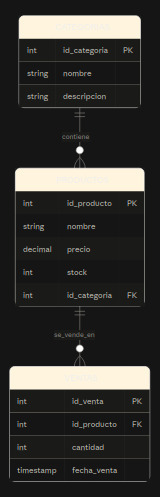

# Proyecto Final - Administración de Base de Datos PostgreSQL

**Integrantes:** Jared Hernández / Oswaldo  
**Materia:** Administración de Bases de Datos  
**Fecha:** 21 de Agosto del 2026  

## 1. Descripción del caso de estudio
Sistema de Control de Inventario y Ventas. El objetivo de esta base de datos es administrar productos clasificados por categorías y registrar las salidas de mercancía (ventas), manteniendo la integridad referencial y asegurando restricciones lógicas de negocio.

## 2. Modelo Relacional

## 3. Requisitos para ejecutar
* Motor de base de datos PostgreSQL (versión 16+).
* Cliente de línea de comandos `psql` (o pgAdmin en su defecto).
* Entorno Linux/Ubuntu o Windows.

## 4. Orden de ejecución de los scripts SQL
Ejecutar los siguientes archivos ubicados en la carpeta `sql/` en este orden estricto:
1. `01_creacion.sql` (Creación de tablas, llaves e índices).
2. `02_datos.sql` (Inserción de registros de prueba).
3. `03_usuarios_permisos.sql` (Asignación de roles de captura y consulta).
4. `04_consultas.sql` (Reportes, uso de JOINs y agregaciones).
5. `05_calidad_monitoreo.sql` (Validación de consistencia y plan de ejecución).

## 5. Procedimientos Administrativos
* **Respaldo y Restauración:** Se realizó un respaldo en formato custom (`-F c`) con `pg_dump` y se restauró exitosamente en una base clonada (`bd_inventario_restaurada`) usando `pg_restore`. Documentado en `respaldo_restauracion/procedimiento.md`.
* **Importación y Exportación:** Se empleó el metacomando `\copy` para la transferencia bidireccional en formato CSV. Documentado en `importacion_exportacion/procedimiento.md`.
* **Automatización:** Se desarrolló un script automatizado para la extracción de respaldos con fecha dinámica. Archivo en `automatizacion/`.

## 6. Pruebas de Usuarios, Monitoreo y Calidad
* **Usuarios:** Se comprobó la seguridad de roles. Al ingresar con `usr_consulta` e intentar ejecutar un `INSERT` en la tabla productos, el SGBD denegó correctamente el acceso (`ERROR: permission denied`).
* **Monitoreo:** El tamaño de la base de datos se mantiene óptimo (7 MB). El análisis con `EXPLAIN` confirmó que la consulta de productos por categoría utiliza eficientemente el índice `Index Scan using idx_productos_categoria`.
* **Calidad de datos:** Las consultas de auditoría confirmaron que no existen duplicados, registros huérfanos ni precios negativos.

## 7. Sección Teórica de MongoDB
El análisis comparativo entre bases relacionales y orientadas a documentos, junto con la propuesta de aplicación para el caso de estudio, se encuentra en el siguiente enlace:
[▶️ Ver Fundamentos de MongoDB](teoria_mongodb/fundamentos.md)

## 8. Conclusiones y Fuentes Consultadas
* **Conclusión:** Este proyecto integró de manera práctica las tareas fundamentales de un DBA: desde el diseño estructurado y la seguridad mediante el principio de menor privilegio, hasta el aseguramiento de los datos mediante respaldos y monitoreo del rendimiento.
* **Declaración de uso de IA:** Se utilizó Inteligencia Artificial (LLM) como apoyo secundario exclusivamente para la estructuración del formato Markdown, depuración de sintaxis SQL y redacción técnica, siendo los conceptos comprendidos y aplicados por los autores.